# Azure Core Architecture

Tenant (Microsoft Entra ID)  
↓  
Subscription (billing and governance boundary)  
↓  
Resource Group (logical container)  
↓  
Resources (VM, Storage, Network, etc.)

## Key Ideas

- The tenant is the top-level identity boundary.
- Subscriptions are used for billing, quotas, and organization.
- Resource groups organize related resources.
- Resources are the actual services you deploy and manage.
