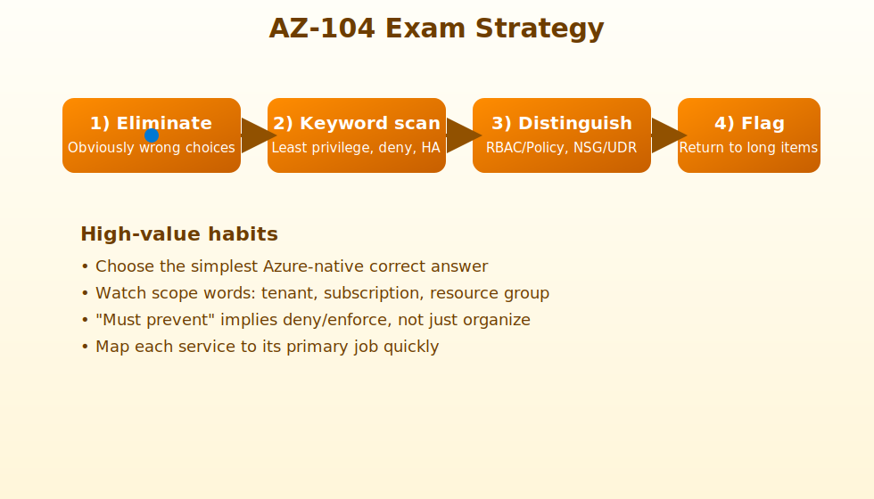

# Exam Strategy

## How to Approach Questions

1. Eliminate clearly wrong answers first.
2. Look for exam keywords:
   - least privilege
   - minimize cost
   - high availability
   - deny
   - enforce
3. Separate:
   - RBAC vs Policy
   - Lock vs Permission
   - NSG vs Route Table
4. Flag long scenario questions and return if needed.

## High-Value Test Habits

- Know which service solves which problem.
- Watch for scope.
- Watch for wording like "must prevent" vs "should organize".
- Prefer the simplest correct Azure-native answer.
