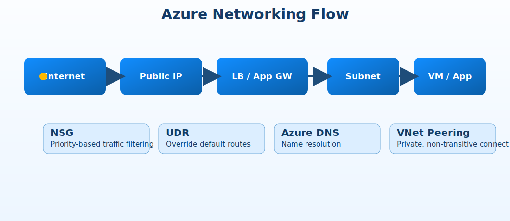

# Azure Networking Flow

Internet  
↓  
Public IP  
↓  
Load Balancer or Application Gateway  
↓  
Subnet  
↓  
VM or App

## Core Controls

- NSG = traffic filter
- UDR = route override
- Azure DNS = name resolution
- Peering = private connection between VNets

## Exam Notes

- NSG rules are processed by priority.
- Peering is not transitive.
- UDRs can override system routes.
