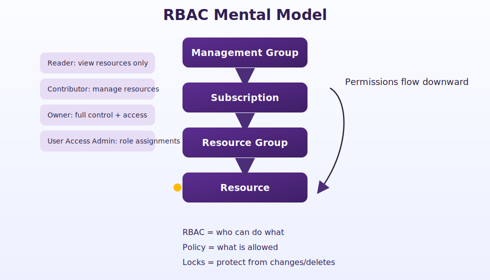

# RBAC Mental Model

Management Group  
↓  
Subscription  
↓  
Resource Group  
↓  
Resource

## Rules

- Permissions flow downward.
- Assign at the lowest scope possible.
- Permissions are additive.

## Common Built-In Roles

| Role | Purpose |
|---|---|
| Reader | View resources only |
| Contributor | Create and manage resources |
| Owner | Full resource and access control |
| User Access Administrator | Manage role assignments |

## Critical Distinctions

- RBAC controls who can do what.
- Azure Policy controls what is allowed.
- Locks protect resources from change or deletion.
