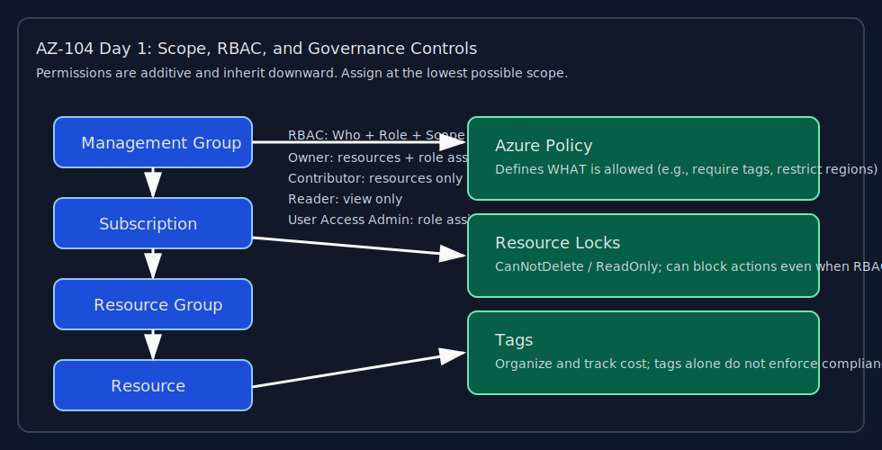
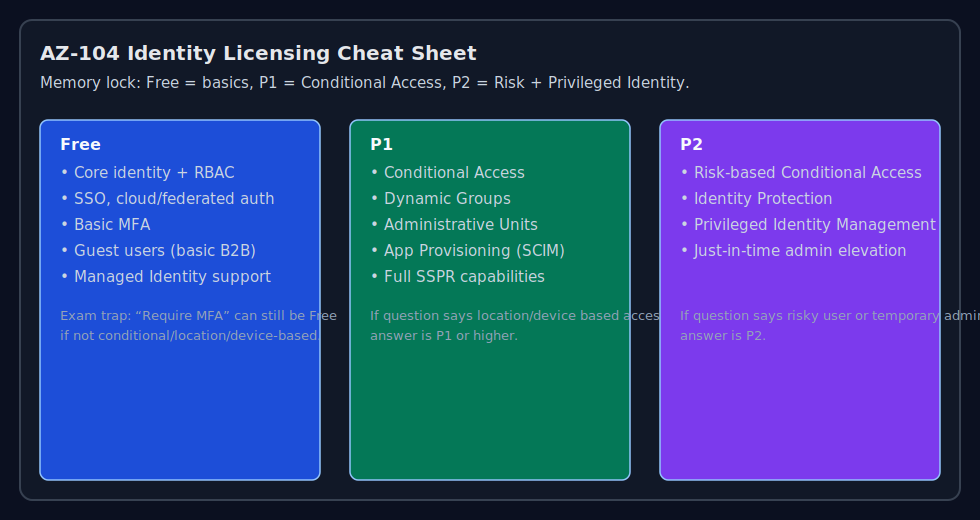

# AZ-104 Bootcamp – Day 1
## Identity, RBAC, and Governance (Exam-Focused)

---

## 🔥 Updated Strategy (Based on Background)

You already have:
- Defender + Sentinel exposure ✅
- Some Azure exposure ✅
- PowerShell + CLI comfort ✅

### Focus areas
- 🔴 Networking (critical gap)
- 🔴 Storage nuances
- 🔴 RBAC + Policy edge cases
- 🔴 Scenario-based thinking

---

## 🧠 Day 1 Objectives

- Microsoft Entra (Identity basics)
- RBAC (Roles + Scope + Inheritance)
- Resource organization (RGs, Subscriptions)
- Azure Policy
- Locks
- Tags
- Cost basics

---

## 🎬 Exam Readiness Zone Deep-Dive (Sarah Kong)

**Source video:** https://learn.microsoft.com/en-us/shows/exam-readiness-zone/preparing-for-az-104-manage-azure-identities-and-governance-1-of-5  
**Use this as your Day 1 anchor review before labs.**

### ⏱️ Timestamped notes (specific + complete for this episode)

#### 00:05–01:47 — Introduction
- Frames this as **Episode 1 of 5** in Exam Readiness Zone for AZ-104.
- Confirms this episode is focused on **Manage Azure identities and governance**.
- Reinforces that success on AZ-104 requires understanding both **identity administration** and **governance controls**, not just memorizing terms.

#### 01:48–03:22 — Objectives
- Maps the episode directly to exam skill area **“Manage Azure identities and governance (20–25%)”**.
- Breaks Day 1 into the three tested objective groups:
  1. **1.1 Manage Microsoft Entra ID users and groups**
  2. **1.2 Manage access to Azure resources**
  3. **1.3 Manage Azure subscriptions and governance**
- Calls out that this domain is heavily scenario-based (you must choose the *best* control for a requirement).

#### 03:23–05:37 — 1.1 Manage Microsoft Entra ID users and groups
- Expect tasks around **creating/managing users and groups** in Microsoft Entra ID.
- Focus on lifecycle operations: update properties, reset credentials, and remove/restore when required.
- Understand **group-based management** and when to use groups instead of direct per-user administration.
- Be comfortable with **guest/external identity collaboration** (B2B-style access patterns).
- Tie identity operations to least-privilege administration and operational efficiency at scale.

#### 05:38–08:39 — 1.2 Manage access to Azure resources
- Connects identity to authorization via **Azure RBAC** (who can do what, at which scope).
- Know core built-in roles and assignment behavior across scope hierarchy:
  - Management group → subscription → resource group → resource
- Emphasizes **scope + inheritance + additive permissions** for exam scenarios.
- Be able to decide and implement least-privilege access by selecting the right role at the right scope.
- Distinguish access assignment concerns (RBAC) from governance compliance concerns (Policy/Locks).

#### 08:40–11:28 — 1.3 Manage Azure subscriptions and governance
- Governance coverage includes organizing resources with:
  - **Management groups**
  - **Subscriptions**
  - **Resource groups**
- Reinforces governance controls you must choose correctly in scenarios:
  - **Azure Policy** for compliance enforcement
  - **Resource locks** for delete/modify protection
  - **Tags** for organization, reporting, and cost tracking
- Highlights operational governance posture: standardization, guardrails, and control at scale.

#### 11:29–12:01 — Other skills
- Briefly references the remaining AZ-104 domains from the 5-part series:
  - Storage
  - Compute
  - Virtual networking
  - Monitoring/maintenance
- Reminder: identity/governance decisions influence all remaining domains.

#### 12:02–End — Review
- Summarizes the exam-focus takeaway:
  - Master Entra users/groups administration
  - Master RBAC access assignment logic
  - Master subscription/resource governance using Policy, locks, and tags
- Recommends validating knowledge with hands-on tasks immediately after concept review.

### ✅ What to add to your Day 1 execution

After watching this video, do these in order:
1. Create users + groups in Entra ID and perform at least one lifecycle change (reset/update/remove/restore pattern).
2. Assign RBAC at different scopes and verify effective access behavior.
3. Apply an Azure Policy assignment, add a lock, and test governance outcomes on a resource group.
4. Tag resources and validate filtering/cost-report grouping.

### 📚 Microsoft Learn links (use with each section)

- Identity + Governance learning path (AZ-104 aligned): https://learn.microsoft.com/en-us/training/paths/preparing-for-az-104-manage-azure-identities-and-governance-1-of-5/
- Azure RBAC module (hands-on): https://learn.microsoft.com/en-us/training/modules/secure-azure-resources-with-rbac/
- Azure Policy module: https://learn.microsoft.com/en-us/training/modules/intro-to-azure-policy/

---

## ⏱️ Time Plan (Day 1)

| Block | Time |
|------|------|
| Concepts | 2–3 hrs |
| Hands-on Labs | 3–4 hrs |
| Practice + Review | 1–2 hrs |

## ⏲️ Day Timer

[▶ Open running timers for this day](../assets/running-timers.html?day=day01)

| Timer | Target |
|---|---|
| Total Day Timer | 8h 00m |

---

## 🔹 STEP 1 – TEACH (Exam-Focused)

**⏲️ Session Timer:** 2h 00m

### 🧩 Azure hierarchy

📘 Microsoft Learn: https://learn.microsoft.com/en-us/azure/governance/management-groups/overview

Management Group  
↓  
Subscription  
↓  
Resource Group  
↓  
Resource

- Permissions flow **downward**.
- Always assign at **lowest scope possible**.



### 🔐 RBAC (Role-Based Access Control)

📘 Microsoft Learn: https://learn.microsoft.com/en-us/azure/role-based-access-control/overview

#### 🔥 Most tested
RBAC = **Who can do what, where**

| Component | Meaning |
|----------|--------|
| Who | User / Group |
| What | Role |
| Where | Scope |

#### 🔑 Built-in roles

📘 Microsoft Learn: https://learn.microsoft.com/en-us/azure/role-based-access-control/built-in-roles

| Role | Can Do | Cannot Do |
|------|--------|----------|
| Reader | View | No changes |
| Contributor | Manage resources | Cannot assign roles |
| Owner | Full control | — |
| User Access Admin | Manage RBAC | No resource control |

#### RBAC scope (critical)
Management Group  
↓  
Subscription  
↓  
Resource Group  
↓  
Resource

#### Rule
Permissions flow down.

#### Built-in roles (final exam form)

| Role | Can Manage Resources | Can Assign Roles | Use Case |
|------|---------------------|------------------|----------|
| Owner | ✅ | ✅ | Full admin |
| Contributor | ✅ | ❌ | Admin without access control |
| Reader | ❌ | ❌ | View only |
| User Access Admin | ❌ | ✅ | Access control only |

#### Specialized roles

| Role | Purpose |
|------|--------|
| VM Contributor | Manage VMs only |
| Backup Operator | Manage backups |
| Security Reader | View security settings |

#### 🔥 Exam rule
If question says:  
“User should manage resources but NOT permissions”

👉 Answer = **Contributor**

#### Exam trap
Assign at higher scope → affects **everything below**.

#### ⚠️ RBAC rules

📘 Microsoft Learn (scope/inheritance): https://learn.microsoft.com/en-us/azure/role-based-access-control/scope-overview

- Permissions are **additive**.
- Higher scope → inherits downward.
- Always use **least privilege**.

#### 🧠 RBAC example
User has:
- Reader @ Subscription
- Contributor @ Resource Group

👉 Result: **Contributor wins at RG**

### RBAC Actions vs NotActions (critical)

#### Actions
What the role **can do**.

#### NotActions
What the role is **explicitly blocked** from doing.

#### Contributor example
Contributor can:
- Create resources
- Modify resources
- Delete resources

BUT cannot:
- Assign roles
- Modify access control

Because of:

```json
"NotActions": [
  "Microsoft.Authorization/*"
]
```

#### 🧠 Memory rule
If you see: “Cannot assign roles”

👉 It is ALWAYS: **Contributor**

### DataActions (advanced)

| Type | Meaning |
|------|--------|
| Actions | Control plane (manage resources) |
| DataActions | Data plane (actual data access) |

#### Example
Storage Account:
- RBAC → can access resource
- DataActions → can read blobs

#### Exam tip
If question involves: “Access to data inside resource”

👉 Think: **DataActions**

### 🛑 Locks

📘 Microsoft Learn: https://learn.microsoft.com/en-us/azure/azure-resource-manager/management/lock-resources

| Lock | Effect |
|------|-------|
| CanNotDelete | Cannot delete |
| ReadOnly | Cannot modify or delete |

🔥 Locks override RBAC.

### 📜 Azure Policy

📘 Microsoft Learn: https://learn.microsoft.com/en-us/training/modules/intro-to-azure-policy/

| Feature | Purpose |
|--------|--------|
| RBAC | WHO can access |
| Policy | WHAT is allowed |

Examples:
- Require tags → Policy
- Restrict region → Policy

### 🏷️ Tags

📘 Microsoft Learn: https://learn.microsoft.com/en-us/azure/azure-resource-manager/management/tag-resources

Used for:
- Cost tracking
- Organization

⚠️ Tags do **NOT** enforce rules → Policy does.

### 🏢 Management groups

📘 Microsoft Learn: https://learn.microsoft.com/en-us/azure/governance/management-groups/overview

Use when:
- Applying rules across multiple subscriptions

### 💰 Cost basics

📘 Microsoft Learn: https://learn.microsoft.com/en-us/azure/cost-management-billing/cost-management-billing-overview

Know:
- Budgets
- Alerts
- Azure Advisor

### Azure AD (Entra ID) quick add

#### Azure AD join types

📘 Microsoft Learn: https://learn.microsoft.com/en-us/entra/identity/devices/overview

| Type | Description |
|------|------------|
| Azure AD Join | Cloud-only devices |
| Hybrid Join | On-prem + Azure |
| Registered | Personal devices |

#### SSPR

📘 Microsoft Learn: https://learn.microsoft.com/en-us/entra/identity/authentication/tutorial-enable-sspr

- Allows users to reset password without admin
- Requires authentication methods configured

#### Guest users

📘 Microsoft Learn: https://learn.microsoft.com/en-us/entra/external-id/what-is-b2b

- External users (B2B)
- Limited access

---

## 🔹 STEP 2 – HANDS-ON LAB

**⏲️ Session Timer:** 3h 30m

### 🎯 Scenario

📘 Microsoft Learn lab support:
- Create and manage resource groups: https://learn.microsoft.com/en-us/azure/azure-resource-manager/management/manage-resource-groups-portal
- Assign Azure roles: https://learn.microsoft.com/en-us/azure/role-based-access-control/role-assignments-portal
- Create policy assignments: https://learn.microsoft.com/en-us/azure/governance/policy/assign-policy-portal

You must:
- Create RG
- Create group
- Assign RBAC
- Enforce tags
- Prevent deletion

### 🔧 Portal steps

1. **Create Resource Group**  
   Name: `rg-day1-core`
2. **Create Group**  
   Name: `vm-operators`
3. **Assign RBAC**  
   Role: Contributor  
   Scope: Resource Group
4. **Add Lock**  
   Type: CanNotDelete
5. **Apply Policy**  
   Require tag: Environment
6. **Test Policy**  
   Try creating resource **without** tag  
   👉 Should fail

### 💻 CLI commands

```bash
az group create --name rg-day1-core --location eastus

az lock create \
  --name no-delete \
  --lock-type CanNotDelete \
  --resource-group rg-day1-core

az lock list --resource-group rg-day1-core --output table
```

### 💻 PowerShell commands

```powershell
Connect-AzAccount

New-AzResourceGroup -Name "rg-day1-core" -Location "EastUS"

New-AzResourceLock `
  -LockName "no-delete" `
  -LockLevel CanNotDelete `
  -ResourceGroupName "rg-day1-core"
```

---

## 🔹 STEP 3 – EXAM TRAPS

**⏲️ Session Timer:** 45m

❌ Trap 1  
User blocked despite Contributor  
👉 Policy restriction

❌ Trap 2  
Owner cannot delete  
👉 Lock exists

❌ Trap 3  
Multiple subscriptions  
👉 Management Group

❌ Trap 4  
Require tags  
👉 Policy, **NOT** tags

❌ Trap 5  
Minimize permissions  
👉 Lowest scope + least role

---

## 🔹 STEP 4 – PRACTICE QUESTIONS

**⏲️ Session Timer:** 1h 45m

Q1  
User must create VMs but NOT assign roles.

A. Owner  
B. Contributor  
C. Reader  
D. Policy Contributor

**Answer: B**

Q2  
Reader @ Subscription + Contributor @ RG. Result?

A. Read only  
B. Full control  
C. Contributor  
D. No access

**Answer: C**

Q3  
Require tag on all resources.

A. RBAC  
B. Tag  
C. Policy  
D. Lock

**Answer: C**

Q4  
Owner cannot delete resource.

A. NSG  
B. Policy  
C. Lock  
D. Subscription

**Answer: C**

Q5  
Same rules across subscriptions.

A. RG  
B. RBAC  
C. Management Group  
D. Tag

**Answer: C**

Q6  
Overrides RBAC?

A. Tag  
B. Policy  
C. Lock  
D. Both B and C

**Answer: D**

Q7  
Access to only one VM.

A. Subscription  
B. RG  
C. Resource  
D. Management Group

**Answer: C**

---

## 🧠 Must memorize

- Scope order: Management Group → Subscription → Resource Group → Resource
- RBAC = WHO
- Policy = WHAT
- Lock = PROTECTION
- Reader = view
- Contributor = manage
- Owner = everything

## 🔁 Reinforcement
Repeat from memory:
- Scope hierarchy
- RBAC vs Policy vs Lock
- Role differences

---

# DAY X – Identity Scenario Drills (AZ-104)

## ⏱️ Time Plan

| Block | Time |
|------|------|
| Concepts Review | 1–2 hrs |
| Scenario Drills | 3–4 hrs |
| Practice + Review | 2 hrs |

## 🔹 STEP 1 – TEACH (EXAM-FOCUSED)

### 🧩 Identity core mapping

| Concept | Meaning |
|--------|--------|
| Entra Joined | Company-owned, cloud-only |
| Hybrid Joined | On-prem + Azure |
| Registered | Personal / BYOD |
| Guest User | External user |
| Managed Identity | App identity (no secrets) |

### 🔐 RBAC quick map

| Role | Capability |
|------|-----------|
| Reader | View |
| Contributor | Manage resources |
| Owner | Full control |
| User Access Admin | Assign roles |

### 🧠 Memory rule

- **Join = Company**
- **Hybrid = Both**
- **Registered = Personal**
- **Guest = External**

## 🔹 STEP 2 – SCENARIO DRILLS

### 🧪 SCENARIO 1
A company uses only cloud services. New laptops should sign in using company accounts with no on-prem dependency.

What should you use?

A. Registered  
B. Entra Joined  
C. Hybrid Joined  
D. Domain Joined

✅ **Answer: B – Entra Joined**

### 🧪 SCENARIO 2
Devices are already domain-joined on-prem but must also appear in Azure for cloud apps.

A. Registered  
B. Entra Joined  
C. Hybrid Joined  
D. Workgroup

✅ **Answer: C – Hybrid Joined**

### 🧪 SCENARIO 3
A user accesses email from a personal phone. The company does not want full control of the device.

A. Registered  
B. Entra Joined  
C. Hybrid Joined  
D. Owner

✅ **Answer: A – Registered**

### 🧪 SCENARIO 4
You need to give a contractor access using their own company login.

A. Member user  
B. Guest user  
C. Managed identity  
D. Local account

✅ **Answer: B – Guest user**

### 🧪 SCENARIO 5
A user must manage VMs but cannot assign permissions.

A. Owner  
B. Contributor  
C. Reader  
D. User Access Admin

✅ **Answer: B – Contributor**

### 🧪 SCENARIO 6
A user must assign permissions but not manage resources.

A. Owner  
B. Contributor  
C. User Access Admin  
D. Reader

✅ **Answer: C – User Access Admin**

### 🧪 SCENARIO 7
Help desk needs read-only access across subscription.

A. Reader  
B. Contributor  
C. Owner  
D. Admin

✅ **Answer: A – Reader**

### 🧪 SCENARIO 8
Users must reset their own passwords.

A. Conditional Access  
B. SSPR  
C. RBAC  
D. NSG

✅ **Answer: B – SSPR**

### 🧪 SCENARIO 9
An app needs to securely access Azure resources without storing credentials.

A. Access keys  
B. SAS  
C. Managed Identity  
D. Guest user

✅ **Answer: C – Managed Identity**

### 🧪 SCENARIO 10
An app needs to access Key Vault securely.

A. Storage key  
B. Managed identity + RBAC  
C. Admin account  
D. Guest

✅ **Answer: B – Managed Identity + RBAC**

### 🧪 SCENARIO 11
You want to group subscriptions and apply policies across them.

A. Resource group  
B. Management group  
C. NSG  
D. Subscription tag

✅ **Answer: B – Management group**

### 🧪 SCENARIO 12
A user has Reader at subscription and Contributor at resource group.

What access do they have in that resource group?

A. Reader  
B. Contributor  
C. Owner  
D. None

✅ **Answer: B – Contributor**

### 🧪 SCENARIO 13
Regional admins should manage only users in their region.

A. Resource groups  
B. Administrative units  
C. NSG  
D. Availability zones

✅ **Answer: B – Administrative units**

### 🧪 SCENARIO 14
Admins should only elevate privileges when needed.

A. Policy  
B. PIM  
C. NSG  
D. Budget

✅ **Answer: B – PIM**

### 🧪 SCENARIO 15
Require MFA when users sign in from outside trusted locations.

A. RBAC  
B. Conditional Access  
C. NSG  
D. UDR

✅ **Answer: B – Conditional Access**

---

## AZ-104 Identity License Cheat Sheet (final – verified)

### 🔑 License tiers

| Tier | Purpose |
|------|--------|
| Free | Core identity + RBAC |
| P1 | Conditional Access + advanced identity |
| P2 | Risk + privileged identity |

### 🧩 Feature → license map (exam-critical)

| Feature | Free | P1 | P2 | Notes |
|--------|------|----|----|------|
| SSO | ✅ | ✅ | ✅ | Always available |
| Cloud/Federated Auth | ✅ | ✅ | ✅ | Core feature |
| RBAC | ✅ | ✅ | ✅ | Always free |
| MFA (basic) | ✅ | ✅ | ✅ | Per-user MFA |
| Conditional Access | ❌ | ✅ | ✅ | LOCATION / DEVICE rules |
| Risk-based CA | ❌ | ❌ | ✅ | User risk / sign-in risk |
| SSPR (basic) | ⚠️ Limited | ✅ | ✅ | Full features need P1 |
| Dynamic Groups | ❌ | ✅ | ✅ | Very testable |
| Administrative Units | ❌ | ✅ | ✅ | Scoped admin |
| App Provisioning | ❌ | ✅ | ✅ | SCIM sync |
| Managed Identity | ✅ | ✅ | ✅ | Azure resource feature |
| Guest Users (B2B) | ✅ | ✅ | ✅ | Basic free |
| PIM | ❌ | ❌ | ✅ | JUST-IN-TIME access |
| Identity Protection | ❌ | ❌ | ✅ | Risk engine |



### 🔥 Most tested license rules

1. “Conditional Access” 👉 ALWAYS = **P1 or higher**
2. “Risk-based decisions” 👉 ALWAYS = **P2**
3. “Just-in-time admin” 👉 ALWAYS = **P2 (PIM)**
4. “Basic MFA” 👉 **FREE**
   - But “Smart MFA (location/device/risk)” 👉 **P1 or P2**
5. “Dynamic group membership” 👉 **P1**
6. “Scoped admin (regional control)” 👉 Administrative Units → **P1**

### 🚨 Exam traps (very important)

- Trap 1: “Require MFA” 👉 Could be Free (basic) **or** P1 (if conditional)
- Trap 2: “Require MFA when outside network” 👉 Conditional Access → **P1**
- Trap 3: “Block risky users” 👉 Identity Protection → **P2**
- Trap 4: “Temporary admin access” 👉 PIM → **P2**
- Trap 5: “Users reset password” 👉 Assume → **P1**

### 🧠 Memory lock

Say this:
- Free = identity basics
- P1 = Conditional Access
- P2 = Risk + Privileged

### 🎯 Final exam strategy

| Keyword | Answer |
|--------|--------|
| Location-based access | P1 |
| Device-based access | P1 |
| Risk-based access | P2 |
| Temporary admin | P2 |
| Basic MFA | Free |

🏁 You are now license-ready.

---

## 🔹 STEP 3 – EXAM TRAPS (Identity Scenarios)

🚨 These will trick you:

- Trap 1: “Personal device” → **Registered**
- Trap 2: “Domain joined + Azure” → **Hybrid**
- Trap 3: “Cloud-only company device” → **Entra Joined**
- Trap 4: “External user” → **Guest**
- Trap 5: “App authentication” → **Managed Identity**
- Trap 6: “Enforce login rules (MFA/location)” → **Conditional Access**
- Trap 7: “Assign permissions only” → **User Access Admin**

## 🔹 STEP 4 – RAPID FIRE QUIZ

Answer quickly without thinking too long:

1. BYOD device → ?
2. On-prem + Azure device → ?
3. External contractor → ?
4. App identity → ?
5. Reset password → ?
6. Assign roles → ?
7. Secure login rules → ?

### ✅ Answers

1. Registered
2. Hybrid Joined
3. Guest
4. Managed Identity
5. SSPR
6. User Access Admin
7. Conditional Access

### 🧠 Final memory lock

Say this out loud:
- Join = Company
- Hybrid = Both
- Registered = Personal
- Guest = External
- Managed Identity = Apps

### 🎯 Goal
If you can answer these instantly → you will **NOT miss identity questions on AZ-104**.

---

## 🚨 Homework

1. Complete lab (portal + CLI)
2. Break it intentionally:
   - Try deleting locked resource
   - Try creating resource without tag
3. Answer:
   - What failed?
   - WHY?

---

## ⏭️ Next: Day 2 (Networking – CRITICAL)

Topics:
- VNets
- Subnets
- NSGs
- Routing
- Peering
